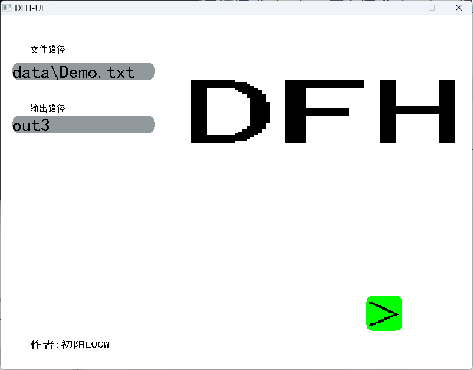
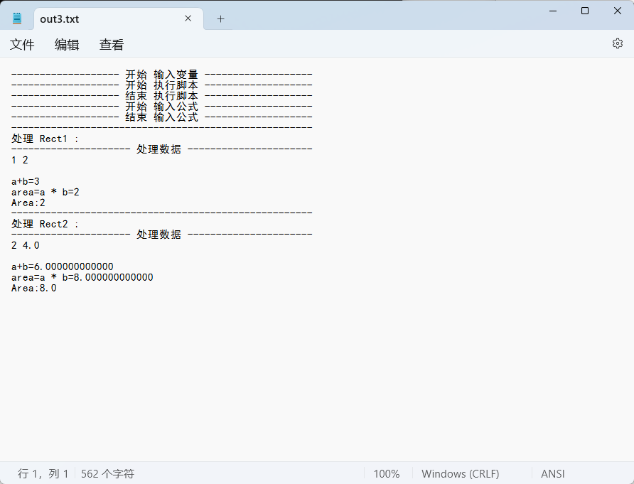

# Data-Formula Handler
### ***版本:0.1***
### ***环境:Windows、Python***
### ***作者:ChuYangLOCW***
## 介绍
***这个项目旨在使用公式处理较多数据.***
## 更新
* ***1.下载release更新UI程序.***
* ***2.下载py_program文件夹下的py文件放到软件本地py_program文件夹下更新数据处理功能***
* ***需要注意的是：release里的数据处理功能可能不是最新***
## 用法
* ***创建一个txt文件***
``` txt
<variables>
a b
</variables>
<py>
def print_area(area):
	print(f"Area:{area}")
</py>
<formulas>
a+b
area=a * b
f-print_area(area)
</formulas>
<data>
;Rect1
1 2
;Rect2
2 4.0
</data>
```
#### 解释
* >\<variables>  **开始输入变量.**
* >\</variables> **停止输入变量.**
* >\<py> **开始执行脚本.**
* >\</py> **停止执行脚本.**
* >\<formulas>  **开始输入公式.**
* >\</formulas> **停止输入公式.**
* >\<data>  **开始处理数据.**
* >\</data> **停止处理数据.**
* >\<dataf> **开始处理数据文件.**
* >\</dataf> **停止处理数据文件.**
* >\<pyf> **开始执行脚本文件.**
* >\</pyf> **停止执行脚本文件.**
* >\<excel> **开始处理Excel文件.**
* >\</excel> **停止处理Excel文件.**
* >***f-*** **是标识不用显示返回值的公式.**
* >***;*** **是数据分区的标识.**
## ***运行***
### 终端
``` sh
python data_formula_handler.py
```
#### 结果
```
输入文件路径:data/Demo.txt


------------------- 开始 输入变量 -------------------
变量顺序:['a', 'b']
------------------- 结束 输入变量 -------------------


------------------- 开始 执行脚本 -------------------
------------------- 结束 执行脚本 -------------------


------------------- 开始 输入公式 -------------------
------------------- 结束 输入公式 -------------------


-----------------------------------------------------
处理 Rect1 :
--------------------- 处理数据 ----------------------
a+b=3
area=a * b=2
Area:2
-----------------------------------------------------
-----------------------------------------------------
处理 Rect2 :
--------------------- 处理数据 ----------------------
处理 Rect2 :
--------------------- 处理数据 ----------------------
a+b=6
area=a * b=8
Area:8
--------------------- 处理数据 ----------------------
a+b=6
area=a * b=8
Area:8
按下任意按键退出...
完成Data处理!
```

### UI窗口
* >在release处下载.
* >下载后解压，然后打开 **ui/bin下的DFH-UI.exe** 即可.
* >在UI界面输入文件路径和输出路径，点击绿色按钮运行即可.

* >输出路径是必填的，输出到 **output** 文件夹下(以output为出发路径).

#### 注意
* >***输入路径是从软件目录开始的相对路径，所以要注意你要处理的文件是否在其目录的子目录下.***
* >***输出路径是必填的，否则会报错，输出文件会在output目录下.***

### 数据会绑定在变量上然后根据公式计算出结果显示.

## 拓展
* >读取py脚本文件
* >读取data集合文件
* >读取Excel文件
##### 如果要用excel文件,注意需要安装openpyxl库
``` sh
pip install openpyxl
```
##### excel编写方式
``` excel
a b
1 2
2 4.0
```
第一行是变量名,第二行开始是数据.

## 提示
* >***"^"*** **代表** ***Python里的"\*\*"***.
* >**pi、e** 是数学符号不建议将其命名为变量.
* >**context.setprec(num)** 设置输出精度(显示到小数点后 **num** 位).
* >如果先要使用函数方法要在方法名前加 **func.** 标识.